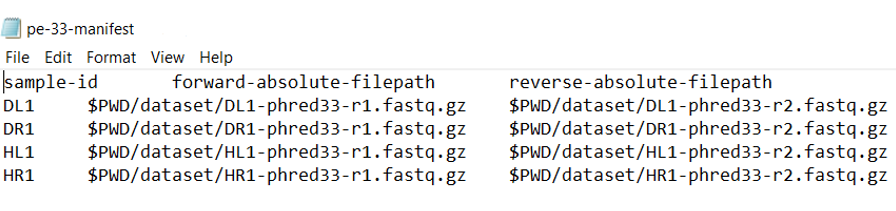

# Mycobiome analysis using QIIME 2 pipeline
## Installing QIIME 2
In order to analyze fungal composition, the QIIME 2 (Quantitative insights Into Microbial Ecology)(Bolyen, Rideout, Matthew R. Dillon, et al., 2019) pipeline  is used. For that, the machine compatible VirtualBox (VB) version (VirtualBox-6.1.34) was installed. Next, 64-bit QIIME Virtual Box software (2022.2 release) was installed via [VirtualBox-Ubuntu](https://data.qiime2.org/distro/core/2022.2) into the machine.
## Data preprocessing
### Obtaining and quality assessment of sequence data

The [FASTQC](https://www.bioinformatics.babraham.ac.uk/projects/fastqc/)  quality assessment tool was installed and the forward and reverse read files of all four samples were subjected to the quality assessment using FASTQC as an initial step.

### Creating and checking the validity of metadata file 
In the context of a microbiome study, sample metadata are any data that describe characteristics of the samples that are being studied. In QIIME 2, metadata were created and stored as a TSV (tab-separated values) file with .tsv or .txt file extension. QIIME 2 metadata files detailed formatting [requirements](https://docs.qiime2.org/2022.2/tutorials/metadata/)  was considered. 

According to the QIIME2 recommendation, sample metadata file which use to go through the pipeline, was needed to validate. Sample metadata files stored in Google Sheets was validated using [Keemei](https://keemei.qiime2.org/)  using select Add-ons > Keemei > Validate QIIME 2 metadata file (Rideout et al., 2016).
### Importing data as QIIME 2 artifacts


The type of raw data from high-throughput amplicon sequencing were in FASTQ format, paired-end DNA sequence reads, demultiplexed formatted (demultiplexing step was not needed), and files consisting of sequences (forward and reverse as R1 and R2 reads, respectively). QIIME 2 works with artifacts instead of data files. Thus QIIME 2 artifacts should be created by importing data. Every artifact generated by QIIME 2 has a semantic type associated with it. Semantic types enable QIIME 2 to identify artifacts that are suitable inputs to an analysis. The manifest file with demultiplexed paired-end sequences with quality was imported as QIIME 2 artifacts (demux.qza) using qiime tools import method. After importing, a summary of the demultiplexed results (demux.qzv) were obtained. It allowed to determine how many sequences were obtained per sample, and to get a summary of the distribution of sequence qualities at each position in the sequence data.

In order to import data, a text file called a “manifest file”, was created which maps sample identifiers to fastq.gz absolute file paths that contain sequence and quality data for the sample (FASTQ files). The first column was defined the Sample ID, while the second and third column defines the absolute filepath to the forward and reverse reads. Absolute-filepath, provided the absolute file path leading to raw sequence files. PairedEndFastqManifestPhred33V2 variant of FASTQ data was specified to QIIME 2 when importing, due to Illumina 1.8 software was used to generate the data.


---
The dataset is not publicly available due to privacy concerns

----


```
unzip -q data.zip
qiime tools import \
  --type 'SampleData[PairedEndSequencesWithQuality]' \
  --input-path pe-33-manifest \
  --output-path paired-end-demux.qza \
  --input-format PairedEndFastqManifestPhred33V2
 ```
 ### Summary of demultiplexed results

```
qiime demux summarize \
  --i-data paired-end-demux.qza \
  --o-visualization paired-end-demux.qzv
```
### remove adapters in demultiplexed paired-end sequences

In order to remove sequencing adapters in the reads in demultiplexed reads, QIIME 2 q2-cutadapt plugin with the trim-paired method, was used. 
```
qiime cutadapt trim-paired \
  --i-demultiplexed-sequences paired-end-demux.qza \
  --p-adapter-f GCATCGATGAAGAACGCAGC \
  --p-front-f GGAAGTAAAAGTCGTAACAAGG \
  --p-adapter-r CCTTGTTACGACTTTTACTTCC \
  --p-front-r GCTGCGTTCTTCATCGATGC \
  --o-trimmed-sequences demux-trimmed.qza
  ```
Summary of trimmed results
```
qiime demux summarize \
 --i-data demux-trimmed.qza \
 --o-visualization demux-trimmed.qzv
```

### Denoising and feature table construction
Reads should be denoised into amplicon sequence variants (ASVs) to reducing sequence errors and dereplicating sequences. Sequences are clustered to collapse similar sequences (≥97%). The dada2 plugin was used to generate a feature table and representative sequence variants according to those the resultant sequence reads were processed, quality controlled and trimmed. In the case of DADA2, these methods filter out noisy sequences, correct errors in marginal sequences, remove chimeric sequences, remove singletons, join denoised paired-end reads, and then dereplicate sequences. DADA2 contain internal chimera checking methods and abundance filtering.
Using two interactive plots which came from demux.qza file, the plot on the left presents the quality scores for the forward reads, and the plot on the right presents the quality scores for the reverse reads. These plots were used to determine what trimming parameters for denoising with DADA2. Then denoise the reads using dada2 denoise-paired. The resultant reads contained 222-bases in forward and 224-bases in reverse. Since primers were removed by q2-cutadapt, the first base of forward and reverse reads was not trimmed, and no trimming was applied to the ends of the sequences as the quality of the bases do not drop below 20 and also to avoid reducing the read length by too much.
The final products after denoising and clustering via dada2 are in table.qza, which indicated how many reads of each ASVs were observed in each sample, rep-seqs.qza which is a list of representative sequences of each ASVs and dada2-stats.qza which is a stats summary with information regarding the filtering and denoising were produced.

Denoising and feature table construction
```
qiime dada2 denoise-paired \
  --i-demultiplexed-seqs demux-trimmed.qza \
  --p-trim-left-f 0 \
  --p-trim-left-r 0 \
  --p-trunc-len-f 222 \
  --p-trunc-len-r 224 \
  --o-table table.qza \
  --o-representative-sequences rep-seqs.qza \
  --o-denoising-stats denoising-stats.qza
```
### Feature table and feature data summarizing

QIIME 2 plugins define methods and visualizers that are used to perform analyses. A method accepts some combination of QIIME 2 artifacts and parameters as input and produces one or more QIIME 2 artifacts as output. These output artifacts could subsequently be used as input to other QIIME 2 methods or visualizers. Methods can produce intermediate or terminal outputs in a QIIME 2 analysis. A visualizer is like a method in that it accepts some combination of QIIME 2 artifacts and parameters as input. In contrast to a method, a visualizer produces exactly one visualization as output and cannot be used as input to other QIIME 2 methods or visualizers. Visualizers can only produce terminal output in a QIIME 2 analysis. Visualization files typically have the .qzv file extension. Visualizations contain similar types of metadata as QIIME 2 artifacts, including provenance information.
After the denoising step completed, the artifacts containing the feature table, corresponding feature sequences, and DADA2 denoising stats were explored by creating visual summaries of the data. The feature-table summarize command on table.qza, provided information on how many sequences are associated with each sample and with each feature, histograms of those distributions, and some related summary statistics as table.qzv. The feature-table tabulate-seqs command on rep-seqs.qza was provided a mapping of feature IDs to sequences and provided links to easily BLAST each sequence against the NCBI nt database as rep-seqs.qzv. The metadata tabulate command on denoising-stats.qza, provided a summary of statistics as denoising-stats.qzv.

Feature table and feature data summarizing
```
qiime feature-table summarize \
  --i-table table.qza \
  --o-visualization table.qzv \
  --m-sample-metadata-file sample-metadata.tsv

qiime feature-table tabulate-seqs \
  --i-data rep-seqs.qza \
  --o-visualization rep-seqs.qzv

qiime metadata tabulate \
  --m-input-file denoising-stats.qza \
  --o-visualization denoising-stats.qzv
```


## Taxonomy assignment and taxonomy analysis
### Train classifier

The taxonomy classifier was trained to predict the taxonomic assignment for each of denoised sequence variants. Fungal ITS classifier, was trained to the [UNITE](https://plutof.ut.ee/#/doi/10.15156/BIO/587481) reference database with full reference sequences. QIIME2 recommend the “developer” sequences for this (located within the QIIME-compatible release download).  The feature-classifier fit-classifier-naïve-bayes method was used to train the classifier.

```
qiime tools import \
 --type FeatureData[Sequence] \
 --input-path developer/sh_refs_qiime_ver7_99_01.12.2017_dev_uppercase.fasta \
 --output-path unite-ver7-99-seqs-01.12.2017.qza

qiime tools import \
 --type FeatureData[Taxonomy] \
 --input-path developer/sh_taxonomy_qiime_ver7_99_01.12.2017_dev.txt \
 --output-path unite-ver7-99-tax-01.12.2017.qza \
 --input-format HeaderlessTSVTaxonomyFormat

qiime feature-classifier fit-classifier-naive-bayes \
 --i-reference-reads unite-ver7-99-seqs-01.12.2017.qza \
 --i-reference-taxonomy unite-ver7-99-tax-01.12.2017.qza \
 --o-classifier unite-ver7-99-classifier-01.12.2017.qza
```
### Taxonomy classification

The query sequences of ASVs were compared to the taxonomy classifiers to determine the closest taxonomic affiliation with some degree of confidence or consensus. Machine-learning-based classification methods were available through classify-sklearn. Feature-classifier classifier-sklearn method was used for this purpose. Naive Bayes classifier which compares query sequences (rep-seqs.qza) to classifier (unite-ver7-99-classifier-01.12.2017.qza) was used to assign taxonomies and visualization of the resulting mapping from sequence to taxonomy were generated as taxonomy.qza and taxonomy.qzv.

Assign taxonomy
```
qiime feature-classifier classify-sklearn \
  --i-classifier unite-ver7-99-classifier-01.12.2017.qza \
  --i-reads rep-seqs.qza \
  --o-classification taxonomy.qza
```

Visualization of taxonomy
```
qiime metadata tabulate \
  --m-input-file taxonomy.qza \
  --o-visualization taxonomy.qzv
```

## Phylogenetic tree building
In order to get diversity metrics, a phylogenetic (rooted) tree was constructed using the ASVs. Phylogenetic tree was generated using align-to-tree-mafft-fasttree method of q2- phylogeny plugin. The pipeline was started by generating a multiple sequence alignment using Fast Fourier Transform algorithm. Aligned sequences were generated by aligning sequence reads. Any alignment columns that were phylogenetically uninformative or ambiguously aligned, were removed (masked). The resulting masked alignment was used to infer a phylogenetic tree. FastTree program was used to generate a phylogenetic tree from the masked alignment. The FastTree program was created an unrooted tree. Midpoint rooting was applied to place the root of the tree at the midpoint of the longest tip-to-tip distance in the unrooted tree. Four output artifacts were produced during this method (aligned-rep-seqs.qza, masked-aligned-rep-seqs.qza, unrooted-tree.qza, rooted-tree.qza). 
```
qiime phylogeny align-to-tree-mafft-fasttree \
  --i-sequences rep-seqs.qza \
  --o-alignment aligned-rep-seqs.qza \
  --o-masked-alignment masked-aligned-rep-seqs.qza \
  --o-tree unrooted-tree.qza \
  --o-rooted-tree rooted-tree.qza
```

## Diversity analysis
Diversity analyses in QIIME 2 were available through the q2 diversity plugin, which supported computing alpha and beta diversity metrics, applying related statistical tests, and generating interactive visualizations. The core-metrics-phylogenetic method, was used which rarefied the FeatureTable[Frequency] to a specified depth, computed several alpha and beta diversity metrics, and generated principle coordinates analysis (PCoA) plots using Emperor for each of the beta diversity metrics. SampleData[AlphaDiversity] artifacts were contained alpha diversity estimates for each sample in feature table which was the chief artifact for alpha diversity analyses. DistanceMatrix artifacts were contained the pairwise distance/dissimilarity between each pair of samples in feature table which was the chief artifact for beta diversity analyses. PCoAResults artifacts contained principal coordinates ordination results for each distance/dissimilarity metrics which were the chief artifact for principal coordinates analyses

Alpha diversity
```
qiime diversity core-metrics-phylogenetic \
  --i-phylogeny rooted-tree.qza \
  --i-table table.qza \
  --p-sampling-depth 1395 \
  --m-metadata-file sample-metadata.tsv \
  --output-dir core-metrics-results
qiime diversity alpha-group-significance \
  --i-alpha-diversity core-metrics-results/faith_pd_vector.qza \
  --m-metadata-file sample-metadata.tsv \
  --o-visualization core-metrics-results/faith-pd-group-significance.qzv
qiime diversity alpha-group-significance \
  --i-alpha-diversity core-metrics-results/evenness_vector.qza \
  --m-metadata-file sample-metadata.tsv \
  --o-visualization core-metrics-results/evenness-group-significance.qzv
qiime diversity alpha-group-significance \
  --i-alpha-diversity core-metrics-results/shannon_vector.qza \
  --m-metadata-file sample-metadata.tsv \
  --o-visualization core-metrics-results/shannon-group-significance.qzv
qiime diversity alpha-group-significance \
  --i-alpha-diversity core-metrics-results/observed_features_vector.qza \
  --m-metadata-file sample-metadata.tsv \
  --o-visualization core-metrics-results/observed_features-group-significance.qzv
```

Beta diversity
```
qiime diversity beta-group-significance \
  --i-distance-matrix core-metrics-results/unweighted_unifrac_distance_matrix.qza \
  --m-metadata-file sample-metadata.tsv \
  --m-metadata-column plant-site \
  --o-visualization core-metrics-results/unweighted-unifrac-plant-site-significance.qzv \
  --p-pairwise

qiime diversity beta-group-significance \
  --i-distance-matrix core-metrics-results/unweighted_unifrac_distance_matrix.qza \
  --m-metadata-file sample-metadata.tsv \
  --m-metadata-column plant-condition \
  --o-visualization core-metrics-results/unweighted-unifrac-plant-condition-significance.qzv \
  --p-pairwise
qiime diversity beta-group-significance \
  --i-distance-matrix core-metrics-results/bray_curtis_distance_matrix.qza \
  --m-metadata-file sample-metadata.tsv \
  --m-metadata-column plant-site \
  --o-visualization core-metrics-results/bray_curtis-plant-site-significance.qzv \
  --p-pairwise

qiime diversity beta-group-significance \
  --i-distance-matrix core-metrics-results/bray_curtis_distance_matrix.qza \
  --m-metadata-file sample-metadata.tsv \
  --m-metadata-column plant-condition \
  --o-visualization core-metrics-results/bray_curtis-plant-condition-significance.qzv \
  --p-pairwise

qiime diversity beta-group-significance \
  --i-distance-matrix core-metrics-results/jaccard_distance_matrix.qza \
  --m-metadata-file sample-metadata.tsv \
  --m-metadata-column plant-site \
  --o-visualization core-metrics-results/jaccard-plant-site-significance.qzv \
  --p-pairwise

qiime diversity beta-group-significance \
  --i-distance-matrix core-metrics-results/jaccard_distance_matrix.qza \
  --m-metadata-file sample-metadata.tsv \
  --m-metadata-column plant-condition \
  --o-visualization core-metrics-results/jaccard-plant-condition-significance.qzv \
  --p-pairwise

qiime diversity beta-group-significance \
  --i-distance-matrix core-metrics-results/weighted_unifrac_distance_matrix.qza \
  --m-metadata-file sample-metadata.tsv \
  --m-metadata-column plant-site \
  --o-visualization core-metrics-results/weighted_unifrac-plant-site-significance.qzv \
  --p-pairwise

qiime diversity beta-group-significance \
  --i-distance-matrix core-metrics-results/weighted_unifrac_distance_matrix.qza \
  --m-metadata-file sample-metadata.tsv \
  --m-metadata-column plant-condition \
  --o-visualization core-metrics-results/weighted_unifrac-plant-condition-significance.qzv \
  --p-pairwise
```